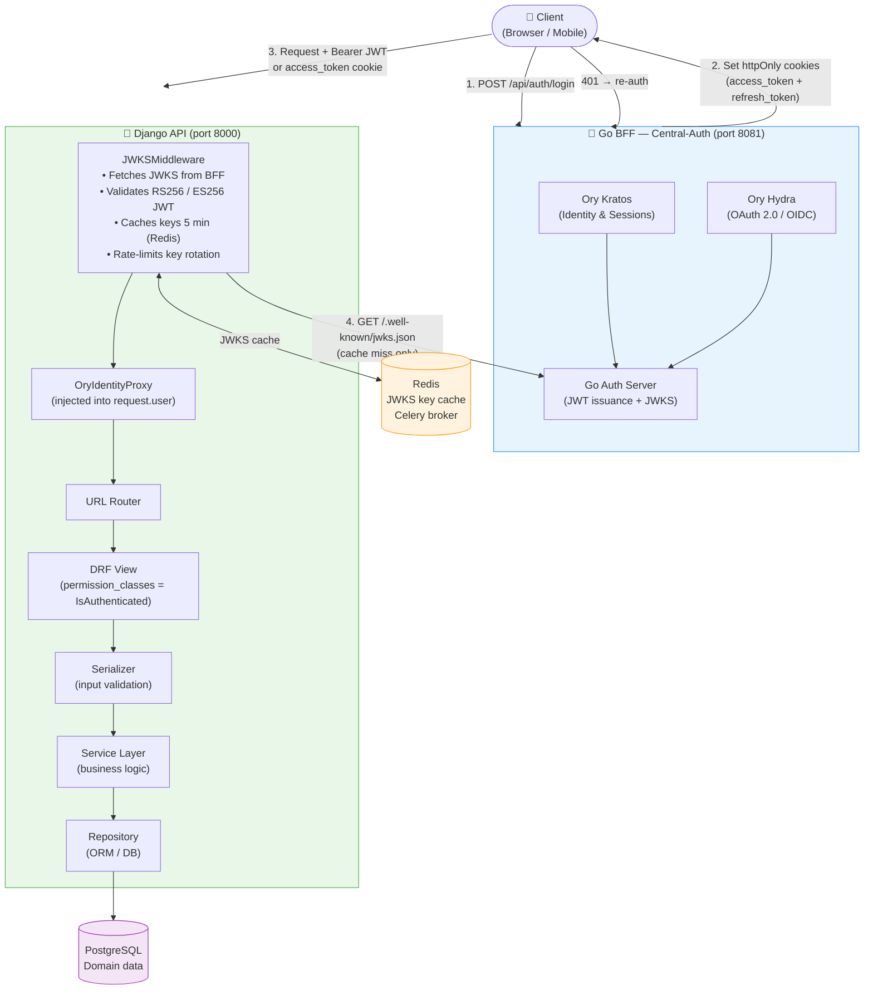
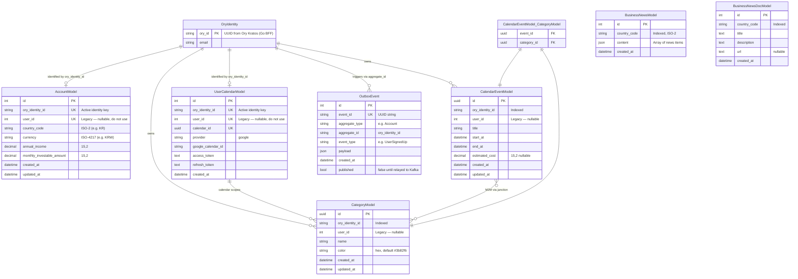

# Hackonomics 2026 — MyEconoCoach


---

## Table of Contents

1. [Project Overview](#1-project-overview)
2. [Architecture](#2-architecture)
3. [Tech Stack](#3-tech-stack)
4. [Features](#4-features)
5. [API Endpoints](#5-api-endpoints)
6. [Database Schema](#6-database-schema)
7. [Authentication Flow](#7-authentication-flow)
8. [Local Development Setup](#8-local-development-setup)
9. [Environment Variables](#9-environment-variables)
10. [Docker Deployment](#10-docker-deployment)
11. [Background Workers](#11-background-workers)
12. [Testing & QA](#12-testing--qa)
13. [Project Structure](#13-project-structure)
14. [Error Code Reference](#14-error-code-reference)
15. [Code Quality](#15-code-quality)

---

## 1. Project Overview

**MyEconoCoach** is a personal financial coaching platform built with Django. It helps individuals understand and optimize their finances by combining real-time economic data, AI-generated insights, and intelligent calendar planning.

### What it does

| Domain | Capability |
|--------|-----------|
| **Authentication** | Ory Kratos JWKS JWT sessions, Google OAuth 2.0, httpOnly cookie transport |
| **Financial Profile** | Store country, currency, annual income, and monthly investable amount |
| **Exchange Rates** | Live USD conversion rates and historical rate charts |
| **Investment Simulation** | Compare Dollar-Cost Averaging (USD) vs fixed-term deposit returns |
| **Business News** | Country-specific business news fetched and summarized via Google Gemini |
| **AI News Chat** | RAG-powered chat over business news with semantic + keyword hybrid search |
| **Smart Calendar** | Financial event calendar with categories, cost tracking, and Google Calendar sync |
| **AI Calendar Advice** | Upload a financial document; Gemini analyzes it and suggests calendar changes |
| **Event Streaming** | Kafka-based outbox pattern for reliable domain event publishing |

### Who it is for

Individual investors and financially-conscious users who want a unified, AI-enhanced view of their personal economic situation — tailored to their country and currency.

---

## 2. Architecture

### 2.1 Request Lifecycle

The Go BFF (Central-Auth) is the single authentication gateway. All identity decisions happen there — Django is a stateless business-logic tier that trusts the signed JWT produced by the BFF.



**Key design decisions:**
- Django never issues tokens — it only validates them against the BFF's JWKS endpoint.
- JWKS public keys are cached in Redis for 5 minutes; a distributed lock prevents DoS amplification during key rotation.
- Public endpoints (`/api/auth/login/`, `/api/auth/signup/`, etc.) bypass the JWKS middleware entirely.
- `OryIdentityProxy` replaces Django's `auth_user`-backed user object; the `ory_identity_id` (Ory UUID) is the primary identity key across all domain models.

---

### 2.2 App Layer Architecture

Each app follows a **Hexagonal / Ports-and-Adapters** architecture:

```
app/
├── domain/           # Entities, value objects, domain events (pure Python)
├── application/
│   ├── ports/        # Abstract interfaces (Repository, EventPublisher)
│   ├── services/     # Use-case orchestration
│   └── usecases/     # Fine-grained use-case classes (accounts)
├── adapters/
│   ├── orm/          # Django ORM models + concrete Repository impl
│   ├── django/       # DRF middleware / authentication adapters
│   └── events/       # Kafka producer/consumer adapters
└── presentation/     # DRF serializers, views, URL routing
```

---

## 3. Tech Stack

### Core

| Layer | Technology |
|-------|-----------|
| Language | Python 3.12 |
| Web Framework | Django 5.2 |
| API Framework | Django REST Framework |
| Database | PostgreSQL 15 (psycopg3) |
| Authentication | Ory Kratos + Go BFF JWKS JWT (httpOnly cookies) + Google OAuth 2.0 |

### Infrastructure

| Service | Role |
|---------|------|
| Redis 7 | JWKS key cache · Celery broker/backend · distributed locks |
| Celery 5 | Async task queue (news fetch) + Beat scheduler (every 6 hours) |
| Apache Kafka 4.1 | Domain event streaming via transactional outbox pattern |
| Qdrant 1.9 | Vector database for RAG semantic search |

### AI & ML

| Library | Role |
|---------|------|
| `google-genai` | Business news generation & calendar advice via Gemini |
| `fastembed` | Text embeddings (BGE-small) + cross-encoder reranking (BGE Reranker) |
| `torch` (CPU) | PyTorch runtime for FastEmbed models |

> **⚠️ PyTorch CPU Wheel**
> `fastembed` depends on PyTorch CPU. The standard `pip install` pulls the GPU wheel by default (several GB).
> Use the CPU-only index to keep the image small:
> ```bash
> pip install torch --index-url https://download.pytorch.org/whl/cpu
> pip install -r requirements.txt
> ```
> The `Dockerfile` already handles this correctly.

> **⚠️ FastEmbed First-Boot Model Download**
> On the first inference request, FastEmbed downloads the BGE-small embedding model and BGE cross-encoder reranker weights (~200 MB total) from HuggingFace. In production containers, either:
> - Pre-warm the container by running a dummy inference in the Docker `CMD`, or
> - Mount a persistent volume at `~/.cache/huggingface/` to survive restarts.
> Without this, the first `/api/news/chat/stream/` request will have elevated latency (~10–30 s).

### Developer Tools

| Tool | Role |
|------|------|
| `drf-spectacular` | Auto-generated OpenAPI 3 schema (Swagger UI + ReDoc) |
| `black` / `isort` / `flake8` | Code formatting & linting |
| `mypy` + `django-stubs` | Static type checking |
| `pytest` + `pytest-django` | Test suite |
| `django-prometheus` | `/metrics` endpoint for Prometheus scraping |
| Docker Compose | Local full-stack orchestration |

---

## 4. Features

### Authentication
- Ory Kratos-backed identity federation via Go BFF
- JWT tokens transported as `httpOnly` cookies (`access_token`, `refresh_token`)
- Google OAuth 2.0 login flow
- Token refresh endpoint
- `remember_me` support (7-day vs 30-day refresh token expiry)
- Password policy: min 8 chars, uppercase, special character required

### Financial Profile
- Store and update country code, currency, annual income, monthly investable amount
- Country/currency validated against live REST Countries data
- Auto-lookup of live USD → user's currency exchange rate on profile read

### Exchange Rates
- Live USD → any currency conversion (ExchangeRate API)
- Historical rate series for 3 months, 6 months, 1 year, 2 years (Frankfurter API)

### Investment Simulation
- Dollar-Cost Averaging (DCA into USD) vs fixed-term deposit comparison
- Uses actual historical exchange rate data for the user's currency
- Returns winner, percentage difference, and a plain-language summary

### Business News (AI + RAG)
- Country-specific business news generated by Google Gemini
- Cached in PostgreSQL, refreshed every 6 hours via Celery Beat
- Distributed Redis lock prevents duplicate concurrent refresh jobs
- News documents indexed into Qdrant for semantic retrieval
- Per-user on-demand refresh via Celery task

### AI News Chat (RAG)
- Hybrid retrieval: dense vector search (Qdrant + BGE embeddings) + BM25 keyword search
- Cross-encoder reranking (BGE Reranker) selects top-3 contexts
- Ordinal shortcut: "first news", "second news" bypasses RAG and fetches directly
- Gemini generates a grounded answer from retrieved contexts
- Streaming SSE response (`text/event-stream`)

### Smart Calendar
- Create, list, update, delete calendar events with titles, date/time range, and estimated cost
- Color-coded categories per user
- Ownership enforcement on all mutations
- Google Calendar OAuth 2.0 integration (connect / store tokens)

### AI Calendar Advice
- Submit any financial document (e.g. tax notice, pay slip) as text
- Gemini analyzes the document against the user's existing calendar events and financial profile
- Returns structured JSON advice: keep / update / delete suggestions per event
- Automatic fallback response if Gemini quota is exhausted

### Event-Driven Architecture
- Outbox pattern: domain events written to `OutboxEvent` table atomically with the business transaction
- Background relay publishes outbox events to Kafka topics
- `accounts` app consumes Kafka events to react to user sign-up events
- Management commands: `run_account_consumer`, `process_outbox`

---

## 5. API Endpoints

> All protected endpoints require a valid JWT delivered via `Authorization: Bearer <token>` header or `access_token` httpOnly cookie.

### Authentication — `/api/auth/`

| Method | Path | Auth | Description |
|--------|------|------|-------------|
| `POST` | `/api/auth/signup/` | Public | Create account (email + password) |
| `POST` | `/api/auth/login/` | Public | Login; sets `access_token` + `refresh_token` cookies |
| `POST` | `/api/auth/logout/` | Public | Clear auth cookies |
| `POST` | `/api/auth/refresh/` | Public | Rotate access token using refresh cookie |
| `GET` | `/api/auth/me/` | JWT | Return current user `ory_id` and email |
| `GET` | `/api/auth/google/login/` | Public | Redirect to Google OAuth consent screen |
| `GET` | `/api/auth/google/callback/` | Public | Google OAuth callback; sets auth cookies |

### Account — `/api/account/`

| Method | Path | Auth | Description |
|--------|------|------|-------------|
| `GET` | `/api/account/me/` | JWT | Retrieve user's financial profile |
| `PUT` | `/api/account/me/` | JWT | Update financial profile (country, currency, income) |
| `GET` | `/api/account/me/exchange-rate/` | JWT | Live USD → user's currency rate |

### Country Metadata — `/api/meta/`

| Method | Path | Auth | Description |
|--------|------|------|-------------|
| `GET` | `/api/meta/countries/` | Public | List all countries with currencies and flags |
| `GET` | `/api/meta/countries/<code>/` | Public | Retrieve a single country by ISO-2 code |

### Exchange Rates — `/api/exchange/`

| Method | Path | Auth | Description |
|--------|------|------|-------------|
| `GET` | `/api/exchange/usd-to/<currency>/` | Public | Current USD → `currency` rate |
| `GET` | `/api/exchange/history/?currency=KRW&period=6m` | Public | Historical USD rates. Periods: `3m` `6m` `1y` `2y` |

### Investment Simulation — `/api/simulation/`

| Method | Path | Auth | Description |
|--------|------|------|-------------|
| `POST` | `/api/simulation/compare/dca-vs-deposit/` | JWT | Compare DCA (USD) vs fixed deposit for the user's currency |

```json
// Request body
{ "period": "1y", "deposit_rate": 3.5 }
```

### Business News — `/api/news/`

| Method | Path | Auth | Description |
|--------|------|------|-------------|
| `GET` | `/api/news/business-news/` | JWT | Latest cached business news for user's country |
| `POST` | `/api/news/business-news/refresh/` | JWT | Queue an on-demand Celery refresh task |
| `POST` | `/api/news/chat/stream/` | JWT | RAG-powered streaming chat (SSE) |

```json
// Chat request body
{ "question": "What are the latest trends in the Korean economy?" }
```

### Calendar — `/api/calendar/`

| Method | Path | Auth | Description |
|--------|------|------|-------------|
| `POST` | `/api/calendar/init/` | JWT | Initialize (or retrieve) user's calendar |
| `GET` | `/api/calendar/me/` | JWT | Get user's calendar details |
| `GET` | `/api/calendar/oauth/login/` | JWT | Get Google Calendar OAuth authorization URL |
| `GET` | `/api/calendar/oauth/callback/` | JWT | Google Calendar OAuth callback |
| `POST` | `/api/calendar/categories/create/` | JWT | Create a new event category |
| `GET` | `/api/calendar/categories/` | JWT | List user's categories |
| `DELETE` | `/api/calendar/categories/<uuid>/` | JWT | Delete a category |
| `POST` | `/api/calendar/events/create/` | JWT | Create a calendar event |
| `GET` | `/api/calendar/events/` | JWT | List all user's events |
| `PUT` | `/api/calendar/events/<uuid>/` | JWT | Update an event |
| `DELETE` | `/api/calendar/events/<uuid>/` | JWT | Delete an event |
| `POST` | `/api/calendar/advisor/` | JWT | Submit a document for AI calendar advice |

```json
// Advisor request body
{ "document_text": "Your salary notice or tax document text here..." }
```

### API Documentation

| Path | Description |
|------|-------------|
| `/api/schema/` | Raw OpenAPI 3 JSON schema |
| `/api/docs/swagger/` | Swagger UI |
| `/api/docs/redoc/` | ReDoc UI |

---

## 6. Database Schema

### ER Diagram

> **Identity Migration Note**
> All domain models carry **two** identity columns:
> - `ory_identity_id` — **active** primary key, an Ory UUID from the Go BFF JWT (`request.user.ory_id`). Use this in all new code.
> - `user_id` — **legacy** nullable integer FK to Django's `auth_user`. Kept during the transition from django-allauth; do not reference in new code.



---

## 7. Authentication Flow

### JWKS Token Validation (Django side)

`JWKSMiddleware` in `authentication/adapters/django/jwks_middleware.py` intercepts every request and validates the JWT locally without a network round-trip on the hot path:

```
Request arrives
    │
    ├── Path in _SKIP_PREFIXES? ──────────────────────────► pass through (public)
    │   (/api/auth/login/, /api/auth/signup/, /admin/, ...)
    │
    ├── Extract token: Authorization: Bearer <tok> or access_token cookie
    │   No token found? ─────────────────────────────────► AnonymousUser
    │
    ├── JWKS in Redis cache? (TTL 5 min)
    │   YES ─► use cached keys
    │   NO  ─► GET {CENTRAL_AUTH_URL}/.well-known/jwks.json  (HTTP fetch)
    │           cache result → Redis
    │
    ├── jwt.decode(token, signing_key, algorithms=["RS256","ES256"])
    │   Verify: exp · nbf · iss (if EXPECTED_JWT_ISSUER set) · aud (if configured)
    │
    │   InvalidSignatureError? ─► acquire Redis distributed lock (30 s TTL)
    │                              force-refresh JWKS once · retry decode
    │
    ├── Success ─► request.user = OryIdentityProxy(ory_id=sub, email=email)
    └── Any failure ─► request.user = AnonymousUser()  (no 401 emitted here)
                        DRF IsAuthenticated will emit 401 at the view layer
```

### OryIdentityProxy

Django's standard `auth_user` table is **not used** for authenticated requests. `OryIdentityProxy` is a lightweight dataclass injected into `request.user`:

```python
@dataclass
class OryIdentityProxy:
    ory_id: str       # == request.user.pk == request.user.id
    email: str
    is_authenticated: bool = True
```

All domain repositories look up records by `ory_identity_id = request.user.ory_id`.

### Token Transport

| Priority | Mechanism | Used by |
|----------|-----------|---------|
| 1 | `Authorization: Bearer <token>` header | API clients, mobile |
| 2 | `access_token` httpOnly cookie | Browser (transition fallback) |

---

## 8. Local Development Setup

### Prerequisites

- Python 3.12
- Docker & Docker Compose
- `env/.env` file (copy from template below)

### 1. Clone and create virtual environment

```bash
git clone https://github.com/syjoe02/Hackonomics-2026.git
cd Hackonomics-2026
python3.12 -m venv venv
source venv/bin/activate
```

### 2. Install dependencies

> **⚠️ PyTorch CPU Wheel** — Install PyTorch CPU-only first to avoid pulling the multi-GB GPU variant:

```bash
pip install torch --index-url https://download.pytorch.org/whl/cpu
pip install -r requirements.txt
```

### 3. Create environment file

Create `env/.env` with the following variables (see [Section 9](#9-environment-variables) for full reference):

```bash
# Django
DJANGO_SECRET_KEY=your-local-dev-secret-key-at-least-50-chars
DJANGO_ENV=development

# Database (matches docker-compose defaults)
DB_NAME=myeconocoach
DB_USER=econ_user
DB_PASSWORD=econ_password
DB_HOST=localhost
DB_PORT=5431

# Redis
REDIS_URL=redis://localhost:6380/0

# Ory / BFF
CENTRAL_AUTH_URL=http://localhost:8081
CENTRAL_AUTH_SERVICE_KEY=your-local-service-key

# External APIs
GEMINI_API_KEY=your-gemini-api-key
GOOGLE_OAUTH_CLIENT_ID=your-google-client-id
GOOGLE_OAUTH_CLIENT_SECRET=your-google-client-secret
PINECONE_API_KEY=your-pinecone-key   # optional — only for Pinecone adapter

# Kafka
KAFKA_BOOTSTRAP_SERVERS=localhost:9092
KAFKA_NODE_ID=1
KAFKA_ADVERTISED_LISTENERS=PLAINTEXT://localhost:9092
```

### 4. Start infrastructure services

```bash
docker compose up postgres redis qdrant kafka -d
```

### 5. Apply migrations and run

```bash
python manage.py migrate
python manage.py runserver 0.0.0.0:8000
```

### 6. Start background workers (separate terminals)

```bash
# Celery worker + beat (news refresh every 6 h)
celery -A config worker -l info &
celery -A config beat -l info &

# Kafka outbox relay
python manage.py process_outbox

# Kafka account event consumer
python manage.py run_account_consumer
```

---

## 9. Environment Variables

| Variable | Required | Default | Description |
|----------|----------|---------|-------------|
| `DJANGO_SECRET_KEY` | Yes | — | Django secret key (min 50 chars) |
| `DJANGO_ENV` | Yes | `development` | `development` \| `prod` — enables fail-fast checks when `prod` |
| `DB_NAME` | Yes | — | PostgreSQL database name |
| `DB_USER` | Yes | — | PostgreSQL user |
| `DB_PASSWORD` | Yes | — | PostgreSQL password |
| `DB_HOST` | Yes | `localhost` | PostgreSQL host |
| `DB_PORT` | Yes | `5431` | PostgreSQL port |
| `REDIS_URL` | Yes | — | Redis connection URL |
| `CENTRAL_AUTH_URL` | Yes | — | Go BFF base URL (e.g. `http://localhost:8081`) |
| `CENTRAL_AUTH_SERVICE_KEY` | Yes | — | Shared secret for service-to-service calls (min 32 chars in prod) |
| `JWKS_URL` | No | `{CENTRAL_AUTH_URL}/.well-known/jwks.json` | Override JWKS endpoint |
| `JWKS_CACHE_TTL` | No | `300` | JWKS cache TTL in seconds |
| `EXPECTED_JWT_ISSUER` | Prod required | — | Expected `iss` claim in JWTs |
| `EXPECTED_JWT_AUDIENCE` | No | — | Expected `aud` claim in JWTs |
| `GEMINI_API_KEY` | Yes | — | Google Gemini API key |
| `GOOGLE_OAUTH_CLIENT_ID` | Yes | — | Google OAuth client ID |
| `GOOGLE_OAUTH_CLIENT_SECRET` | Yes | — | Google OAuth client secret |
| `PINECONE_API_KEY` | No | — | Pinecone API key (optional adapter) |
| `KAFKA_BOOTSTRAP_SERVERS` | Yes | — | Kafka bootstrap servers |
| `KAFKA_NODE_ID` | Yes | `1` | Kafka node ID (KRaft mode) |
| `KAFKA_ADVERTISED_LISTENERS` | Yes | — | e.g. `PLAINTEXT://localhost:9092` |
| `METRICS_BASIC_AUTH_USER` | No | — | Username for `/metrics` Basic Auth |
| `METRICS_BASIC_AUTH_PASSWORD` | No | — | Password for `/metrics` Basic Auth |
| `METRICS_ALLOWED_CIDR` | No | — | Comma-separated IP CIDRs allowed to scrape `/metrics` |
| `TESTING` | No | `false` | Set `true` in test runs to bypass JWKS validation |

> **Production fail-fast checks** — When `DJANGO_ENV=prod`, startup raises `ImproperlyConfigured` if `DJANGO_SECRET_KEY` contains `"insecure"`, `CENTRAL_AUTH_SERVICE_KEY` contains `"super-secret-service-key"`, or `DEBUG=True`.

---

## 10. Docker Deployment

The `docker-compose.yml` defines 8 services connected on the `default` network plus an optional `shared-monitor-net` for Prometheus/Grafana.

```
docker compose up -d
```

| Container | Image | Port | Role |
|-----------|-------|------|------|
| `myeconocoach-web` | Local build | `8000` | Gunicorn (4 workers) |
| `myeconocoach-db` | `postgres:15-alpine` | `5431` | Primary database |
| `myeconocoach-redis` | `redis:7-alpine` | `6380` | Cache + Celery broker |
| `myeconocoach-qdrant` | `qdrant/qdrant:latest` | `6333` | Vector store |
| `myeconocoach-kafka` | `apache/kafka:4.1.1` | `9092` | Event broker (KRaft) |
| `myeconocoach-celery-worker` | Local build | — | Async task worker |
| `myeconocoach-celery-beat` | Local build | — | Periodic task scheduler |
| `myeconocoach-outbox-worker` | Local build | — | Kafka outbox relay |

### Health checks

All infrastructure services (`postgres`, `redis`, `qdrant`, `kafka`) have Docker health checks. The `web`, `celery-*`, and `outbox-worker` containers use `depends_on: condition: service_healthy` — they will not start until their dependencies pass.

> **⚠️ FastEmbed First-Boot**
> The first time the `celery-worker` or `web` container processes a RAG inference request, FastEmbed downloads ~200 MB of model weights from HuggingFace. Mount a named volume or host path to `/root/.cache/huggingface/` to persist these across container restarts.

### Monitoring stack

A separate `shared-monitor-net` Docker network connects this stack to an external Prometheus + Grafana deployment. The `/metrics` endpoint is protected by IP CIDR allowlist and HTTP Basic Auth (see `METRICS_ALLOWED_CIDR`, `METRICS_BASIC_AUTH_*` env vars).

---

## 11. Background Workers

### Celery Beat — News Refresh (every 6 hours)

Defined in `config/celery.py`. Runs `news.tasks.fetch_business_news_task` for each active country code. Uses a Redis distributed lock to prevent overlapping runs.

```bash
celery -A config beat -l info --schedule /tmp/celerybeat-schedule
```

### Celery Worker — On-Demand Tasks

Processes tasks enqueued by `POST /api/news/business-news/refresh/`. Also runs any ad-hoc tasks triggered by other app operations.

```bash
celery -A config worker -l info
```

### Outbox Worker — Kafka Relay

`events/management/commands/process_outbox.py` — polls `OutboxEvent` records where `published=False`, publishes them to Kafka, and marks them `published=True`. Runs as a long-lived process with restart-on-failure policy in Docker.

```bash
python manage.py process_outbox
```

### Account Event Consumer

`accounts/management/commands/run_account_consumer.py` — subscribes to the Kafka `user.signed_up` topic and reacts to new user registration events (e.g. initializing the Account profile row).

```bash
python manage.py run_account_consumer
```

---

## 12. Testing & QA

### Test Results

```
37 passed in 25.07s  (0 failed, 0 errors)
```

Tests are organized in two files:

| File | Tests | Coverage |
|------|-------|---------|
| `tests.py` | 33 | Exchange, Meta, Simulation, Accounts, Calendar, Auth endpoints |
| `authentication/tests.py` | 4 | JWKS middleware: JWT validation, cache hit/miss, key rotation |

### Running Tests

```bash
# Full suite (requires PostgreSQL on port 5431 and TESTING=True)
DJANGO_ENV=test \
TESTING=true \
DB_USER=<user> DB_PASSWORD=<pass> DB_NAME=<db> DB_HOST=localhost DB_PORT=5431 \
DJANGO_SECRET_KEY=test-key \
venv/bin/python -m pytest tests.py authentication/tests.py -v
```

When `TESTING=True`, `JWKSMiddleware` injects a stable test identity (`ory_id=00000000-0000-0000-0000-000000000001`, `email=test@example.com`) without contacting the BFF — this is the intended test isolation mechanism.

### Test Categories

| Category | What is tested |
|----------|---------------|
| **Exchange** | USD conversion and history endpoint status codes |
| **Meta** | Country list and detail status codes |
| **Simulation** | DCA vs deposit comparison — success, empty payload, wrong types, wrong method |
| **Accounts** | Profile retrieval and exchange rate sub-endpoint |
| **Calendar** | Init, OAuth, categories, events, advisor — success and error cases |
| **Auth** | Login, signup, logout, refresh, me — success and validation |
| **JWKS Middleware** | Valid JWT maps identity; cache hit skips HTTP; cache miss triggers fetch; key rotation acquires lock and retries |

---

## 13. Error Code Reference

All API errors follow this envelope:

```json
{
  "status": "error",
  "code": "ERROR_CODE_STRING",
  "message": "Human-readable description"
}
```

| HTTP | Code | Meaning |
|------|------|---------|
| 400 | `INVALID_PARAMETER` | Query param or path param invalid |
| 400 | `VALIDATION_FAILED` | Serializer validation failed |
| 400 | `MISSING_REQUIRED_FIELD` | Required field absent in request body |
| 400 | `PASSWORD_TOO_SHORT` | Password below minimum length (8 chars) |
| 400 | `PASSWORD_POLICY_VIOLATION` | Missing uppercase or special character |
| 400 | `GOOGLE_AUTH_CODE_MISSING` | OAuth code parameter missing |
| 401 | `INVALID_CREDENTIALS` | Wrong email / password |
| 401 | `UNAUTHORIZED` | No valid JWT present |
| 401 | `TOKEN_INVALID` | JWT malformed or signature invalid |
| 401 | `TOKEN_EXPIRED` | JWT has expired |
| 401 | `REFRESH_TOKEN_MISSING` | Refresh cookie absent |
| 401 | `REFRESH_TOKEN_INVALID` | Refresh token rejected by BFF |
| 401 | `GOOGLE_AUTH_FAILED` | Google OAuth exchange failed |
| 403 | `FORBIDDEN` | Authenticated but not authorized for this resource |
| 403 | `ACCESS_DENIED` | Generic access denial |
| 403 | `USER_BLOCKED` | Account is blocked |
| 403 | `USER_SUSPENDED` | Account is suspended |
| 403 | `USER_DELETED` | Account has been deleted |
| 404 | `DATA_NOT_FOUND` | Generic resource not found |
| 404 | `USER_NOT_FOUND` | User record not found |
| 404 | `FILE_NOT_FOUND` | File resource not found |
| 404 | `USER_CALENDAR_NOT_FOUND` | Calendar not initialized for user |
| 405 | `METHOD_NOT_ALLOWED` | HTTP method not supported |
| 409 | `DUPLICATE_ENTRY` | Unique constraint violation |
| 409 | `DATA_INTEGRITY_VIOLATION` | Generic integrity error |
| 413 | `FILE_TOO_LARGE` | Request payload exceeds limit |
| 415 | `UNSUPPORTED_MEDIA_TYPE` | Content-Type not accepted |
| 500 | `FILE_UPLOAD_FAILED` | Storage operation failed |
| 500 | `INTERNAL_ERROR` | Unhandled server error |
| 501 | `NOT_IMPLEMENTED` | Feature stub not yet implemented |
| 502 | `EXTERNAL_API_FAILED` | Upstream API call failed |
| 502 | `INVALID_RESPONSE` | Upstream returned unexpected format |
| 502 | `GOOGLE_USERINFO_FAILED` | Google userinfo endpoint failed |
| 503 | `SERVICE_UNAVAILABLE` | Downstream service is down |
| 504 | `TIMEOUT` | Upstream request timed out |

---

## 14. Code Quality

### Lint & Format

```bash
make lint
# Runs: black . && isort . && flake8 . && mypy .
```

| Tool | Config file | Purpose |
|------|-------------|---------|
| `black` | `pyproject.toml` | Auto-format, line-length 88, target py311 |
| `isort` | `pyproject.toml` | Import ordering (black-compatible profile) |
| `flake8` | `.flake8` | PEP 8 linting, max-line-length 88 |
| `mypy` | `pyproject.toml` | Static type checking (py3.11, ignore missing stubs) |

All tools skip `venv/`, `.venv/`, and `migrations/`.

### Type Annotations

All domain entities, use-cases, and service layer functions carry full type annotations. ORM models use annotated class variables (`field: models.CharField = models.CharField(...)`) to satisfy mypy without `django-stubs` plugin issues.
